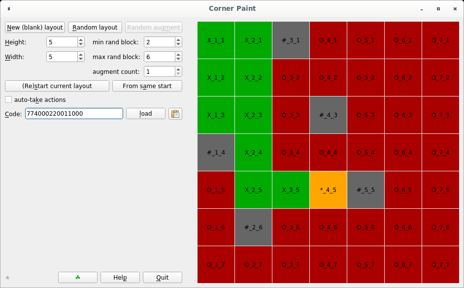

# Corner Paint

A grid-based puzzle game with lights.

## Description

Corner Paint presents a rectangular grid of tiles which are either "lights" or
are "blocked". Lights start "off" (red). The goal of the game is to switch all
the lights on (green). To do so, you start at a tile that contains a red light
and move as far as you can in one of the cardinal directions, switching lights
on.

The idea is not mine; rather, it appears as a minigame in the adventure game
"Machinarium" (e.g. [see
here](https://machinarium.fandom.com/wiki/Glasshouse_Control_Box_Puzzle)). I do
not know if there is a proper name for this game; if you know, please tell me!
(I think I got the colours the wrong way round, though.)

Grid layouts can be generated randomly, or edited manually. The game starts in
"layout" mode, where right-clicking toggles whether a tile is blocked.
Left-click on a red light starts the game. Moves can be made either with the
arrow keys on the keyboard, or by clicking on the tile adjacent to the active
one in the desired direction.

Once started, the game can be reset to start the layout over, or a new layout
can be generated. Random generation always results in a solvable layout, but any
manually created layout may not be solvable. A console message at game start
will indicate this either way. The "random augment" function adds blocked tiles
to the existing layout randomly in a way that results in a solvable layout. For
each layout, a hexadecimal code is shown that can be used to restore the layout
later.

## Building and running

The game is written in standard C++ and uses the Qt library. (There is also a
command-line interface that has no dependencies at all.) To build, make sure
that you have Qt 5 installed on your system, and run `make`. The game binary is
called `game_qt`, and the command-line interface is `game_cli`.

## Limitations

The random generation of layouts runs a brute-force search until it succeeds.
This can take a very long time for large layouts, and it can even run forever
if, say, you attempt to augment an impossible layout (e.g. a disconnected one).

## To-do and wishlist

*   Random generation should be interruptible.
*   Random augmentation should detect whether a solution is impossible.
*   Unit tests, benchmarks.
*   An Android build.
